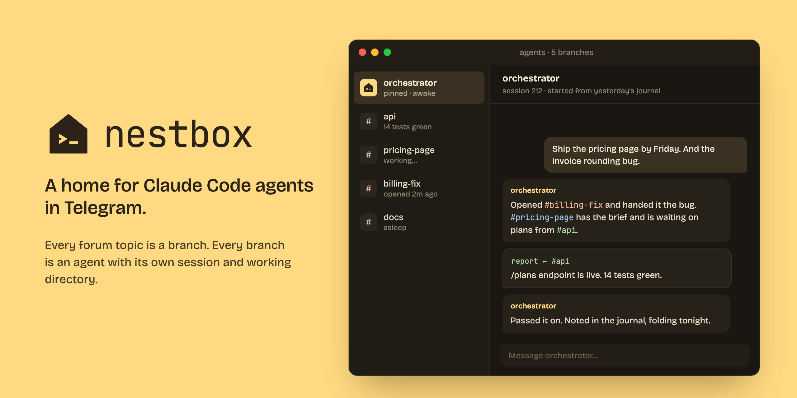

<p align="center"></p>

# nestbox

A home for Claude Code agents in Telegram.

Every forum topic in a group is a branch, and every branch is one agent with its
own session and working directory. One of them is the orchestrator: it lives in
a pinned topic, never sleeps, opens and drops branches for the others, hands
them tasks and reads their reports. It also keeps a journal for itself and
folds it every night, so each new session starts from yesterday instead of from
nothing.

nestbox talks to Claude Code through the
[Agent SDK](https://docs.claude.com/en/docs/agent-sdk/overview), so tools,
skills, MCP servers, hooks and `CLAUDE.md` keep working as usual. Only the
transport is ours.

## How it looks

- **One topic, one agent.** A branch topic shows a plain `typing…` status while
  the agent works, and every block of text the agent finishes arrives as its own
  message, so a quick "on it" shows up before the work is done. The run summary
  (`✅ web · 1m19s · 15 tool calls`) is appended to the last message.
- **Tool calls stay out of the way.** They go to the group's general channel as
  one message per run, with the run's thinking and tool calls folded into a
  details block, in the order they actually happened, plus what the run cost.
- **Files both ways.** Attachments are downloaded and handed to the agent as
  paths. The agent sends a file back by writing `[[send:/absolute/path]]` on its
  own line. Files over the Bot API's 20 MB limit are pulled over mtproto.

## The orchestrator

The default agent in `config/agents.toml` is the orchestrator. It runs with the
full user context (user settings, memory, skills) and carries an in-process MCP
server named `nestbox` with four tools:

| tool | what it does |
| --- | --- |
| `agents` | list branches: who is asleep, busy, has a session |
| `delegate` | run a task in another branch and wait for its report |
| `new_branch` | create a topic and an agent behind it |
| `drop_branch` | delete a branch together with its topic |

`delegate` goes through the same runner as a normal message, so the owner sees
the whole exchange in the subagent's topic, and the report comes back to the
orchestrator as the tool result.

Subagents run with a bare context and a short system prompt that keeps them in
their directory. A branch is either in `ask` mode (read and explain, no edits)
or `work` mode.

### Events

Anything outside can wake the orchestrator: `bin/nudge "<text>"` drops a file
into `data/events`, and the bot turns it into a run in the orchestrator's
branch. Cron watchers use it instead of messaging the owner directly, so a
failing container lands on the orchestrator first. If the bot itself is down,
`nudge` falls back to a direct message.

A first line of `#quiet` makes the run silent: nothing is posted unless it
fails. `nestbox.vibewatch` uses this to follow a
[vibegram](https://github.com/shinzo13/vibegram) room and wake the orchestrator
when another agent speaks.

### Journal

The orchestrator keeps a journal in `JOURNAL_DIR`, one file per day, written in
the first person for its own reading. The prompt gets `summary.md` plus the days
the summary has not folded yet, with every cut announced out loud: a silently
lost piece of a note to yourself reads as "this never happened".

`bin/nightly` (run it from cron) asks the orchestrator to reread the pending
days, rewrite the summary and request a clean session. The supervisor waits
for the run to finish and brings it back with the new summary.

### Manual sessions

`bin/main-shell` takes the orchestrator's session into your terminal and hands
it back on exit. While it is out, the bot tells you it is busy.

## Setup

Requirements: Python 3.12+, [uv](https://docs.astral.sh/uv/), Claude Code
logged in on the machine.

1. Create a bot with [@BotFather](https://t.me/BotFather), create a group with
   topics enabled, and add the bot as an admin with the *manage topics* right.
2. Configure:

   ```bash
   uv sync
   cp .env.example .env                           # BOT_TOKEN, OWNER_ID, CHAT_ID
   cp config/agents.example.toml config/agents.toml
   ```

3. Run it:

   ```bash
   uv run python -m nestbox
   ```

   On first start the bot creates the orchestrator's topic. If you started it
   in a private chat, send `/bind` in the group to move everything there.

The bot answers only `OWNER_ID`. Agents run with `bypassPermissions` unless
`permission_mode` says otherwise in `config/agents.toml`, so run it on a machine
where that is acceptable.

To keep it running, a systemd user unit is enough:

```ini
[Unit]
Description=nestbox

[Service]
WorkingDirectory=%h/nestbox
ExecStart=%h/.local/bin/uv run python -m nestbox
Restart=always

[Install]
WantedBy=default.target
```

## Commands

| command | what it does |
| --- | --- |
| `/branch` | configure this branch: title, icon |
| `/agents` | configured agents |
| `/new` | start this branch's session over |
| `/wake` | keep the agent process up between messages |
| `/sleep` | put it to sleep, the session is kept |
| `/btw <question>` | side question on a forked session, the branch stays untouched |
| `/usage` | remaining subscription limits |
| `/sessions` | active branches |
| `/stop` | cancel the running task |

## Layout

```
nestbox/
  core/engine/    the only code that knows about Claude Code
  core/           registry, sessions, branches, journal, delegation tools, usage
  bot/            aiogram layer: handlers, runner, reply stream, formatting
  bigfile.py      mtproto download for files over 20 MB
  vibewatch.py    vibegram room listener
bin/              nudge, nightly, say, main-shell
config/           agents.example.toml
assets/           logo, avatars, banner
```

`core/engine/base.py` is a neutral contract (a `RunRequest` in, a stream of
events out) and `core/engine/claude.py` implements it over the Agent SDK.

## License

MIT
